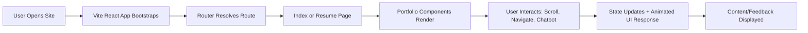
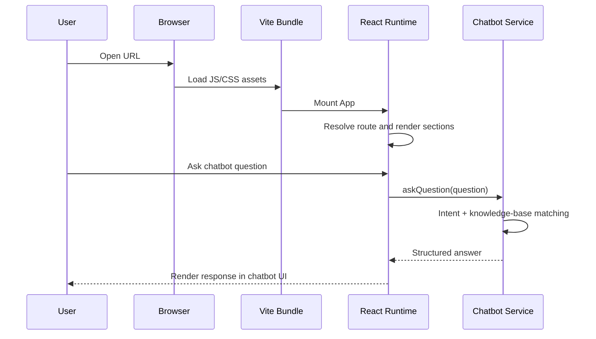
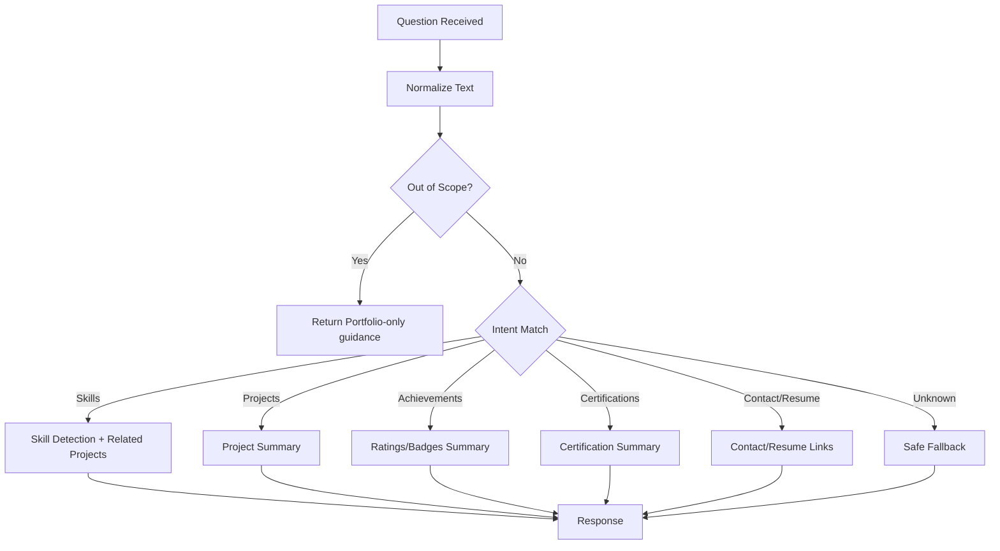

# PRLR Portfolio

<div align="center">


Professional dark-mode portfolio platform with animated sections, project showcase, achievement highlights, and a portfolio-grounded chatbot assistant.

[Live Demo](https://ct.ofzen.in/) • [Architecture](./architecture.md) • [Project Documentation](./projectdocumentation.md)

</div>

## Project Overview
This project is a modern, production-ready personal portfolio for **Rama Lokesh Reddy Penumallu**. It presents technical profile data through a polished UI and a structured content system.

Core goals:
- Present projects, internships, achievements, certifications, and contact details in one place.
- Deliver a fast and responsive user experience across devices.
- Use a chatbot that answers only from verified portfolio data.
- Maintain a clean, scalable frontend architecture for easy updates.

## Tech Stack
| Layer | Technology | Why It Is Used |
|---|---|---|
| UI Framework | React 18 | Component-driven architecture and fast UI rendering |
| Language | TypeScript | Safer refactoring and stronger maintainability |
| Build Tool | Vite | Fast dev server and optimized production bundle |
| Styling | Tailwind CSS | Rapid, consistent utility-based design system |
| Animations | Framer Motion | Smooth interactive transitions and reveal effects |
| Routing | React Router | SPA routing for `/` and `/resume` flows |
| Data Utilities | TanStack Query | Structured async state patterns where needed |
| Forms | React Hook Form | Lightweight and scalable form handling |
| UI Primitives | Radix + shadcn/ui | Accessible, reusable base components |

## Code Structure
```text
.
|-- public/
|   |-- profile-photo.jpg
|   `-- robots.txt
|-- src/
|   |-- assets/
|   |-- components/
|   |   |-- portfolio/      # Page sections + chatbot + UX components
|   |   `-- ui/             # Reusable UI primitives
|   |-- hooks/              # Accessibility and toast hooks
|   |-- lib/                # Constants, helpers, performance, chatbot logic
|   |-- pages/              # Route-level screens (Index, ResumePage, NotFound)
|   |-- providers/          # Theme provider and context (dark-only)
|   |-- App.tsx
|   |-- index.css
|   `-- main.tsx
|-- index.html
|-- vite.config.ts
|-- tailwind.config.ts
|-- architecture.md
|-- projectdocumentation.md
`-- README.md
```

## System Workflow


## Execution Flow Diagram


## Chatbot Processing Flow


## Setup And Installation
### Prerequisites
- Node.js 18+
- npm 9+

### Local Setup
1. Clone repository.
```bash
git clone https://github.com/ramalokeshreddyp/PRLR-PROFILE.git
cd PRLR-PROFILE
```

2. Install dependencies.
```bash
npm install
```

3. Start development server.
```bash
npm run dev
```

4. Open local app.
```text
http://localhost:8080/
```

## How To Run Locally
```bash
npm run dev      # Start dev server
npm run build    # Production build
npm run preview  # Preview built app
npm run lint     # Lint checks
```

## Usage Instructions
1. Open the home page and navigate section-by-section.
2. Use `Back to Top`, scroll progress, and section visuals for navigation.
3. Open chatbot from the floating button.
4. Ask portfolio-grounded questions like:
   - `What are your skills?`
   - `Tell me about your projects`
   - `What certifications do you have?`
   - `How can I contact you?`
5. Open `/resume` route for embedded resume preview and Drive actions.

## Design Principles
- Dark-mode-only visual language for consistency.
- Motion with purpose: transitions support readability and interaction feedback.
- Information hierarchy first: sections are organized to support recruiter scanning.
- Maintainability: business data and UI behavior are separated (`lib/` vs `components/`).

## Documentation Map
- `README.md`: quick onboarding + execution and usage view.
- `architecture.md`: deep architecture and design decisions.
- `projectdocumentation.md`: full technical and operational documentation.

## Maintainer
**Rama Lokesh Reddy Penumallu**

- GitHub: https://github.com/ramalokeshreddyp
- LinkedIn: https://www.linkedin.com/in/rama-lokesh-reddy/
- Email: rlpreddy565@gmail.com

- [Shadcn/ui](https://ui.shadcn.com/) - Component library
- [Tailwind CSS](https://tailwindcss.com/) - Styling framework
- [Framer Motion](https://www.framer.com/motion/) - Animation library
- [Lucide Icons](https://lucide.dev/) - Icon set

---

<div align="center">

**⭐ Star this repository if you found it helpful!**

Made with ❤️ by Rama Lokesh Reddy

</div>
